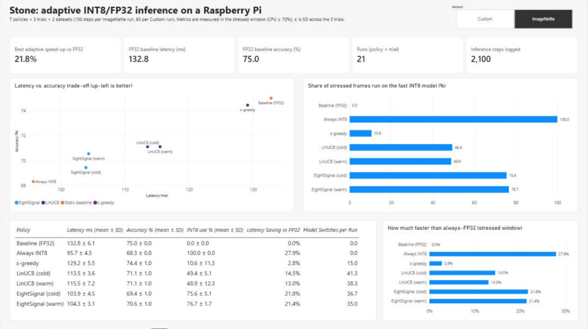
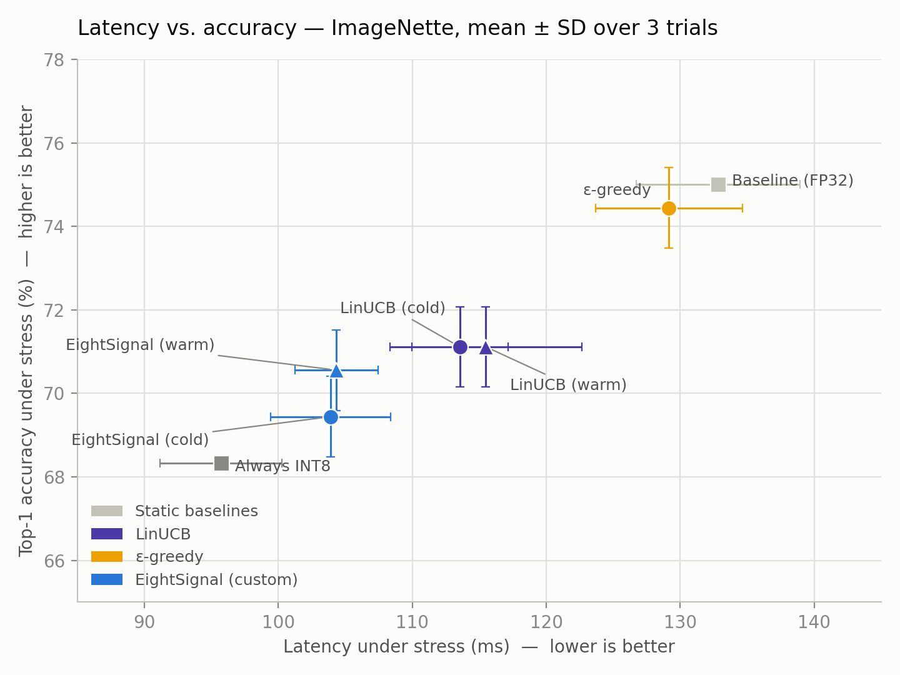
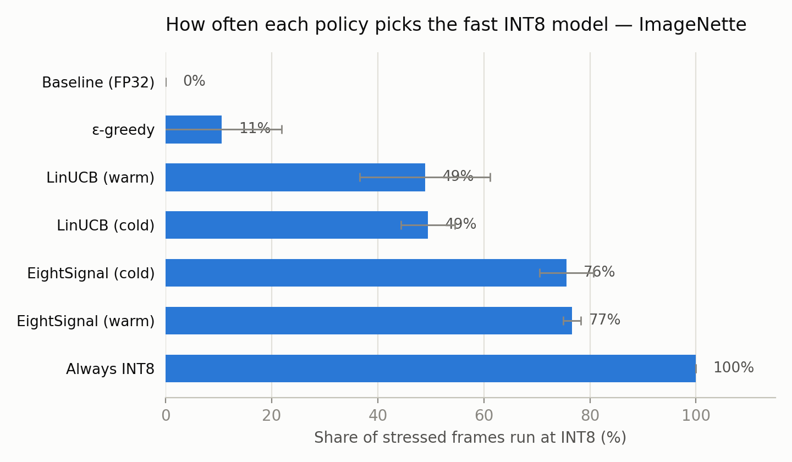
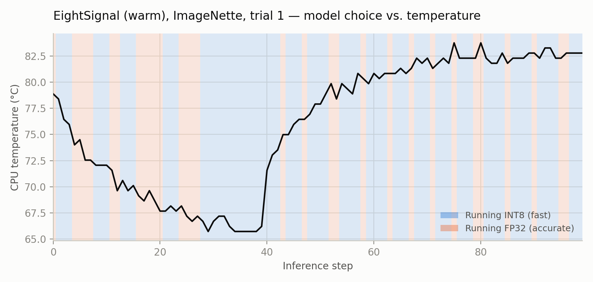
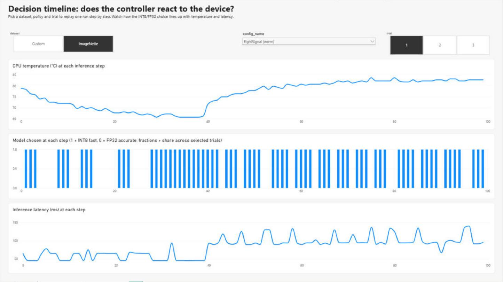

# Stone: results analysis of adaptive INT8/FP32 inference on a Raspberry Pi

**Stone** is a runtime that picks, image by image, whether to run a MobileNetV2 classifier at **INT8** (fast, less accurate) or **FP32** (accurate, slower). It makes that choice from live device telemetry (CPU load, RAM, temperature), and learns it online with bandit-style policies.

This branch covers **the evaluation and analysis**: collecting the experiment data on the Pi, turning the raw logs into analysis-ready tables, and answering "which policy wins, by how much, and is it reacting to the device?" with statistics, charts and a Power BI dashboard.

## Experiment design

| | |
|---|---|
| Hardware | Raspberry Pi, MobileNetV2 in INT8 and FP32 TFLite variants |
| Policies | Baseline (always FP32), Always INT8, ε-greedy, LinUCB (cold/warm start), EightSignal (custom policy, cold/warm start) |
| Datasets | ImageNette (100 steps per run), a custom image set (60 steps per run) |
| Repeats | 3 trials per policy per dataset |
| Load | Each run has a normal phase and a stressed phase. Headline metrics use the **stressed window (CPU ≥ 70%)**, where the latency/accuracy trade-off actually bites. |

## Results (ImageNette, stressed window, mean ± SD over 3 trials)

| Policy | Latency (ms) | Accuracy (%) | INT8 use (%) | Faster than FP32 |
|---|---|---|---|---|
| Baseline (FP32) | 132.8 ± 6.1 | 75.0 ± 0.0 | 0.0 | n/a |
| Always INT8 | 95.7 ± 4.5 | 68.3 ± 0.0 | 100.0 | 27.9% |
| ε-greedy | 129.2 ± 5.5 | 74.4 ± 1.0 | 10.6 ± 11.3 | 2.8% |
| LinUCB (cold) | 113.5 ± 3.6 | 71.1 ± 1.0 | 49.4 ± 5.1 | 14.5% |
| LinUCB (warm) | 115.5 ± 7.2 | 71.1 ± 1.0 | 48.9 ± 12.3 | 13.0% |
| EightSignal (cold) | 103.9 ± 4.5 | 69.4 ± 1.0 | 75.6 ± 5.1 | 21.8% |
| EightSignal (warm) | 104.3 ± 3.1 | 70.6 ± 1.0 | 76.7 ± 1.7 | 21.4% |

**Findings**

1. **Every adaptive policy lands between the two static baselines.** The question is where. EightSignal sits closest to the fast corner: it is about 21% faster than FP32 and recovers 1–2 accuracy points over always-INT8.
2. **The latency ranking is robust; the accuracy ranking is not.** The latency gap between EightSignal (~104 ms) and LinUCB (~114 ms) is larger than the trial-to-trial SD. The accuracy gap between them (70.6% vs 71.1%) is within one SD, so I don't claim either is more accurate.
3. **INT8 usage explains the latency differences.** ε-greedy barely leaves FP32 (11% INT8). LinUCB splits about 50/50. EightSignal runs INT8 on about 76% of stressed frames.

4. **The controller reacts to load, and doesn't just average out.** Across its ImageNette runs, EightSignal chose INT8 on **58% of steps under normal load and 76% under stress**. The single-run timeline below shows the same thing: longer FP32 stretches while the device is cool, and only brief FP32 probes once load and temperature climb.

5. **The custom dataset can't separate the policies on accuracy.** All seven configs score 50.0% there, so it only supports latency and INT8-usage comparisons. The latency ordering matches ImageNette.

## Power BI dashboard

[`dashboard/Stone_Dashboard.pbix`](dashboard/Stone_Dashboard.pbix) has two pages:

- **Results overview:** a dataset switch, KPI cards, the trade-off scatter, INT8-usage and speed-up bars, and a mean ± SD table.
- **Decision timeline:** pick a dataset, policy and trial to replay one run step by step (temperature, model chosen, latency).

**Model:** `Steps` (fact, one row per inference step) and `TrialSummary` (one row per run) both link to two dimension tables, `Configs` and `Datasets`. The metrics are DAX measures: mean and SD across trials, speed-up vs. the FP32 baseline using `CALCULATE` + `REMOVEFILTERS`, and formatted "mean ± SD" labels.

