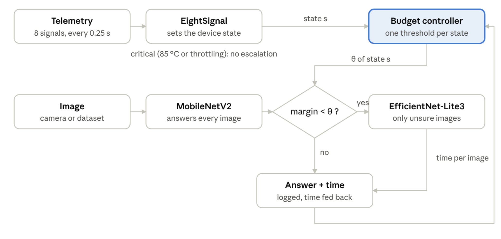
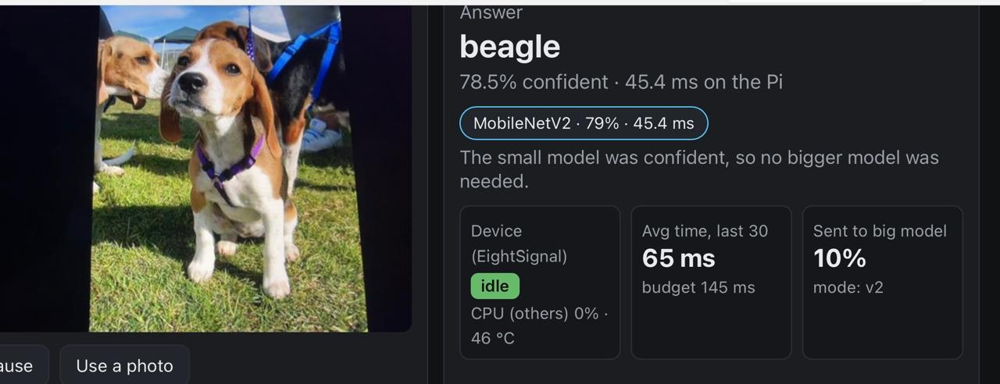
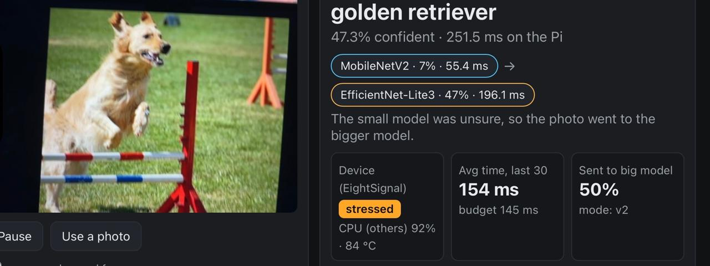

# STONE

**Adaptive, resource- and input-aware model selection for edge devices.**

For every photo, STONE asks two questions: *how much can the device afford right now?* and *does this photo need a bigger model?* A small model answers first. Unsure photos go to a bigger model, less often when the device is busy, so the average time per photo stays within a fixed budget on a Raspberry Pi 4.

<!-- TODO: add the architecture figure (Fig. 1 of the paper) -->


## How it works

1. **Device layer.** The EightSignalController reads eight device signals (CPU, frequency, memory, temperature and others) and decides whether the Pi is *idle* or *stressed*. Above 85 °C, or when the firmware throttles the CPU, STONE switches to *critical* (small model only).
2. **Photo layer.** A small model (MobileNetV2) looks at every photo first. If it is unsure (its top-two margin is below a threshold θ), the photo also goes to a bigger model (EfficientNet-Lite3).
3. **Time budget.** After every photo, θ moves: over budget means fewer photos are escalated, under budget means more. Each device state keeps its own θ. No labels are needed.

All models are INT8 TensorFlow Lite files running on LiteRT with XNNPACK.

## Results

Raspberry Pi 4, 800 unseen Imagewoof photos (480 under `stress-ng` load), 150 ms budget, one session.

| Method | Accuracy (all) | Avg. time under stress | Stressed photos over budget |
|---|---|---|---|
| Static EfficientNet-Lite0 | 74.9% | 114 ms | 0% |
| Static EfficientNet-Lite1 | 80.9% | 163 ms | 71% |
| Static EfficientNet-Lite2 | 79.0% | 203 ms | 98% |
| Epsilon-greedy (six models) | 74.9% | 113 ms | 6% |
| LinUCB (Lite2 or Lite0) | 75.2% | 144 ms | 29% |
| EightSignalController alone | 74.8% | 131 ms | 17% |
| **STONE** | **81.5%** | **153 ms** | 26% |

STONE is 6.3 to 6.7 points more accurate than every method that keeps the budget (McNemar p < 0.001). It ties static Lite1 on accuracy (p = 0.71) while Lite1 misses the budget on 71% of stressed photos.

## Snapshots demo

A phone points its camera at photos, sends frames to the Pi, and the page shows the answer, which model(s) ran, the device state and a live chart of time per photo against the budget.

<!-- TODO: add demo screenshot, idle device -->


<!-- TODO: add demo screenshot, stressed device -->


## Quick start (Raspberry Pi 4)

```bash
cd ~/stone
python3 -m venv ~/v2env
~/v2env/bin/pip install -r v2/requirements.txt
sudo apt install stress-ng
```

Download the EfficientNet-Lite models (not stored in git):

```bash
cd v2/models_ext
for i in 0 1 2 3 4; do
  wget -q https://storage.googleapis.com/cloud-tpu-checkpoints/efficientnet/lite/efficientnet-lite$i.tar.gz
  tar -xzf efficientnet-lite$i.tar.gz
done
mv efficientnet-lite*/*.tflite . && cd ~/stone
```

Put the Imagewoof dataset at `datasets/imagewoof2-320/` ([download](https://github.com/fastai/imagenette)).

**Run the demo** (port 8001; phones need https for the camera):

```bash
~/v2env/bin/python -m v2.demo_server --target-ms 145 --certfile cert.pem --keyfile key.pem
```

Then open `https://<pi-address>:8001` on a phone. The demo needs `v2/configs/operating_points_ladder.json`. If it is missing, create it with the steps below.

**Reproduce the experiments:**

```bash
PY=~/v2env/bin/python bash v2/pi_profile_ladder.sh   # model speeds, idle and stressed (~12 min)
PY=~/v2env/bin/python bash v2/pi_run_ladder.sh       # tune thresholds, write the config (~80 min)
PY=~/v2env/bin/python bash v2/pi_run_compare.sh      # the 7-method comparison (~90 min)
```

Results are written to `v2/results_v2/suite/<tag>/analysis/`.

## Repository layout

```
v2/                   STONE
  demo_server.py      live demo (FastAPI)
  web/index.html      demo page
  routing/            device layer, photo layer, time budget
  common/             model engine, labels, datasets
  bench/              profiling, offline tuning (replay)
  run_suite_v2.py     experiment runner
  analyse_v2.py       results tables and statistics
  configs/            tuned operating points
  models_ext/         EfficientNet-Lite models
  tests/              unit tests
runtime/              original runtime, incl. the EightSignalController (used unchanged)
models/               original MobileNetV2 models and labels
```

## Team

Adithya P S, Akash A and Fathima Rafah.
